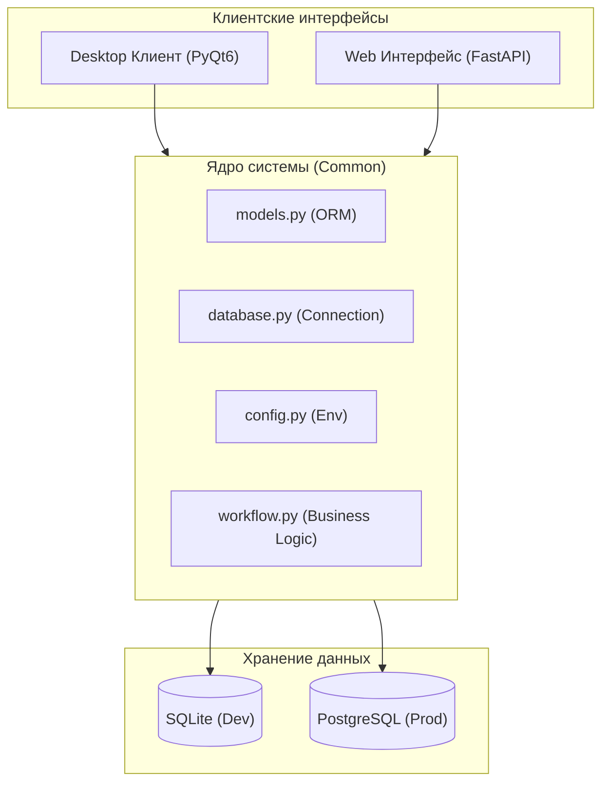
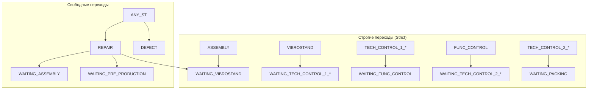

# 📖 Production Manager — Подробная документация

> **Production Manager** — кроссплатформенная система управления производственным конвейером с десктопным (PyQt6) и веб-интерфейсом (FastAPI). Автоматизирует учёт устройств, генерацию серийных номеров, отслеживание статусов на каждом этапе сборки и контроль действий сотрудников.

---

## 📋 Оглавление

1. [Архитектура проекта](#1-архитектура-проекта)
2. [Технологический стек](#2-технологический-стек)
3. [Структура проекта](#3-структура-проекта)
4. [Модели данных](#4-модели-данных)
5. [Роли и авторизация](#5-роли-и-авторизация)
6. [Десктопное приложение](#6-десктопное-приложение)
7. [Веб-интерфейс](#7-веб-интерфейс)
8. [Бизнес-логика и переходы](#8-бизнес-логика-и-переходы)
9. [Настройка и запуск](#9-настройка-и-запуск)
10. [Миграция на PostgreSQL](#10-миграция-на-postgresql)
11. [Сборка и развёртывание](#11-сборка-и-развёртывание)
12. [Производительность и масштабирование](#12-производительность-и-масштабирование)
13. [Устранение проблем](#13-устранение-проблем)
14. [Передача фото на сетевую шару](#14-передача-фото-на-сетевую-шару)
15. [Глоссарий](#15-глоссарий)

---

## 1. Архитектура проекта

Система состоит из трёх основных частей:

| Компонент | Технология | Назначение |
| :--- | :--- | :--- |
| **Desktop-клиент** | PyQt6 | Рабочее место сборщика/администратора с полнофункциональным GUI |
| **Web-клиент** | FastAPI + Jinja2 + Chart.js | Удалённый доступ, мониторинг и аналитика через браузер |
| **База данных** | SQLite / PostgreSQL | Единое хранилище для обоих интерфейсов |

Обе части приложения используют общий слой ORM-моделей (`src/models.py`) и конфигурации (`src/config.py`), что гарантирует согласованность данных.

### Визуализация архитектуры



---

## 2. Технологический стек

### Ядро

| Зависимость | Версия | Назначение |
| :--- | :--- | :--- |
| Python | 3.10+ | Основной язык |
| SQLAlchemy | 2.x | ORM и работа с БД |
| python-dotenv | latest | Загрузка `.env` |

### Десктоп (GUI)

| Зависимость | Назначение |
| :--- | :--- |
| PyQt6 | Графический интерфейс |
| matplotlib | Графики и аналитика |

### Веб

| Зависимость | Назначение |
| :--- | :--- |
| FastAPI | Веб-фреймворк и REST API |
| Uvicorn | ASGI-сервер |
| Jinja2 | Шаблонизатор |
| Chart.js | Визуализация данных в браузере |
| starlette.sessions | Cookie-сессии |

### База данных

| Компонент | Назначение |
| :--- | :--- |
| SQLite | Локальная разработка, тестирование |
| PostgreSQL 16+ | Продакшн, сетевая работа нескольких пользователей |
| psycopg2-binary | Драйвер PostgreSQL для Python |

### Сборка и развёртывание

| Инструмент | Назначение |
| :--- | :--- |
| PyInstaller | Упаковка в `.exe` |
| Docker Compose | Быстрый запуск PostgreSQL |

---

## 3. Структура проекта

```text
appwin/
├── .env.example              # Шаблон переменных окружения
├── .gitignore                # Исключения Git
├── docker-compose.yml        # PostgreSQL контейнер
├── db.sqlite3                # Локальная SQLite база
│
├── src/                      # Ядро приложения (общее для Desktop и Web)
│   ├── __init__.py
│   ├── main.py               # Точка входа Desktop-версии
│   ├── config.py             # Конфигурация из .env
│   ├── database.py           # SQLAlchemy engine и сессии
│   ├── models.py             # ORM-модели (зеркало Django-моделей)
│   ├── logic/
│   │   └── workflow.py       # WorkflowEngine — валидация переходов
│   └── ui/                   # PyQt6 интерфейс
│       ├── styles.py         # CSS-подобные стили для темной темы
│       ├── login_dialog.py   # Диалог авторизации
│       ├── main_window.py    # Главное окно с QTabWidget
│       ├── dashboard_tab.py  # Вкладка: Дашборд
│       ├── projects_tab.py   # Вкладка: Проекты
│       ├── pipeline_tab.py   # Вкладка: Конвейер
│       ├── scan_tab.py       # Вкладка: Сканирование
│       ├── device_status_tab.py  # Вкладка: Статус SN
│       ├── sn_pool_tab.py    # Вкладка: Пул SN
│       ├── analytics_tab.py  # Вкладка: Аналитика
│       ├── admin_tab.py      # Вкладка: Управление персоналом
│       └── widgets/          # Кастомные виджеты
│           └── pipeline_card.py  # Карточка устройства для конвейера
│
├── web/                      # Веб-интерфейс
│   ├── main.py               # Точка входа FastAPI
│   ├── setup_db.py           # Инициализация БД для веба
│   ├── api/                  # REST API (JSON)
│   │   ├── dashboard_api.py
│   │   ├── analytics_api.py
│   │   ├── projects_api.py
│   │   ├── pipeline_api.py
│   │   ├── devices_api.py
│   │   ├── sn_pool_api.py
│   │   ├── admin_api.py
│   │   └── scan_api.py
│   ├── routes/               # HTML-маршруты
│   │   ├── auth.py
│   │   ├── dashboard.py
│   │   ├── analytics.py
│   │   ├── projects.py
│   │   ├── pipeline.py
│   │   ├── scan.py
│   │   ├── devices.py
│   │   ├── sn_pool.py
│   │   └── admin.py
│   ├── templates/            # Jinja2 HTML-шаблоны
│   │   ├── base.html
│   │   ├── login.html
│   │   ├── dashboard.html
│   │   ├── analytics.html
│   │   ├── projects.html
│   │   ├── pipeline.html
│   │   ├── scan.html
│   │   ├── devices.html
│   │   ├── sn_pool.html
│   │   └── admin.html
│   └── static/
│       ├── css/main.css
│       └── js/main.js
│
├── build.py                  # Скрипт сборки через PyInstaller
├── build_release.ps1         # PowerShell-скрипт сборки
├── production_manager.spec   # Спецификация PyInstaller
├── run_web.ps1               # Запуск веб-сервера
├── migrate_sqlite_to_pg.py   # Миграция SQLite → PostgreSQL (прямая)
└── migrate_to_postgres.py    # Миграция SQLite → PostgreSQL (интерактивная)
```

---

## 4. Модели данных

Модели полностью совместимы с Django-бэкендом (`office-task-manager`) и используют те же имена таблиц с префиксами приложений.

### 4.1. Пользователи и авторизация

**`accounts_user`** — учётные записи сотрудников

- `username`, `first_name`, `last_name`, `email`
- `password` — хэш в формате Django `pbkdf2_sha256$iterations$salt$hash`
- `role` — `ADMIN`, `MANAGER`, `EMPLOYEE`, `WORKER`
- `action_pin` — 4-значный PIN для подтверждения операций
- `is_active`, `is_superuser`, `is_staff`

**`auth_group`** — группы пользователей (стандартная Django-таблица)

**`accounts_user_groups`** — связь пользователь ↔ группа

### 4.2. Проекты и устройства

**`tasks_project`** — производственный проект

- `code` — уникальный внутренний код
- `name`, `description`
- `manager_id` — ответственный менеджер
- `status` — `PLANNING`, `ACTIVE`, `ON_HOLD`, `COMPLETED`, `CANCELLED`
- `deadline`, `spec_link`, `spec_code`

**`tasks_devicemodel`** — модель устройства для генерации SN

- `category` — категория (`TIOGA`, `JBOX`, `MONITOR`, `RACK` и т.д.)
- `name` — название модели
- `sn_prefix` — префикс серийного номера (напр. `60LXTRDC`)

**`tasks_serialnumber`** — пул серийных номеров

- `sn` — уникальный серийный номер
- `model_id` — привязка к модели
- `is_used` — занят ли номер устройством
- `device_id` — привязка к конкретному устройству

**`tasks_device`** — устройство

- `code` — код устройства
- `project_id` — привязка к проекту
- `name`, `serial_number`, `part_number`
- `device_type` — тип (`COMPUTER`, `MONITOR`, `TIOGA`, `JBOX`, `RACK` и др.)
- `is_semifinished` — является ли полуфабрикатом
- `status` — текущий статус (30+ значений конвейера)
- `current_worker_id` — текущий ответственный работник
- `location` — текущее местоположение

**`tasks_operation`** — операция над устройством

- `device_id` — привязка к устройству
- `title`, `description`
- `status` — `PENDING`, `IN_PROGRESS`, `COMPLETED`, `CANCELLED`
- `group_id` — группа-исполнитель
- `created_by_id` — создатель операции

### 4.3. Производство

**`production_workplace`** — рабочее место (стенд)

- `name`, `workplace_type` — тип (`ASSEMBLY`, `VIBROSTAND`, `TECH_CONTROL_1_1` и т.д.)
- `is_pool` — является ли пулом
- `pool_limit` — лимит устройств в пуле
- `accepts_semifinished` — принимает ли полуфабрикаты
- `restrict_same_worker` — ограничение на одного работника
- `device_status_on_enter` — требуемый статус при входе
- `order` — порядок в конвейера
- `is_active`

**`production_workplace_allowed_groups`** — связь workplace ↔ разрешённые группы

**`production_workplace_allowed_sources`** — связь workplace ↔ источники (откуда можно прийти)

**`production_worksession`** — сессия работника на рабочем месте

- `workplace_id`, `worker_id`
- `started_at`, `ended_at`
- `is_active`

**`production_worklog`** — журнал производственных действий

- `worker_id`, `session_id`, `workplace_id`
- `device_id`, `project_id`
- `action` — тип действия (`SCAN_IN`, `COMPLETED`, `DEFECT` и т.д.)
- `old_status`, `new_status` — смена статуса
- `serial_number`, `part_number`
- `missing_parts`, `defective_part_sn` — информация о браке/недостаче
- `notes` — комментарии

---

## 5. Роли и авторизация

### 5.1. Роли

| Роль | Код | Доступ |
| :--- | :--- | :--- |
| **Администратор** | `ADMIN` | Полный доступ ко всем вкладкам, управление проектами, справочниками, персоналом. Может удалять операции, сбрасывать пулы SN |
| **Менеджер** | `MANAGER` | Создание и редактирование проектов, дашборды, аналитика. Доступ к админ-панели (с подтверждением пароля) |
| **Сотрудник** | `EMPLOYEE` | Ограниченный доступ к основным рабочим вкладкам |
| **Работник производства** | `WORKER` | Только вкладка «Сканирование». Не видит дашборды и настройки |

### 5.2. Механизм авторизации

**Desktop:**

1. При запуске появляется `LoginDialog` с полями username/password
2. Пароль проверяется через Django-совместимый метод `User.check_password()` (pbkdf2_sha256)
3. При успешном входе открывается `MainWindow` с набором вкладок, зависящим от роли
4. Админ-панель требует повторного ввода пароля при каждом переходе

**Web:**

1. Авторизация через `/login` с cookie-сессией
2. Сессия хранится 24 часа (`SessionMiddleware`)
3. Каждая страница проверяет наличие `user_id` в сессии

---

## 6. Десктопное приложение

### 6.1. Точка входа

```python
src/main.py → main()
```

1. Инициализация `QApplication` с High-DPI масштабированием
2. Отображение `LoginDialog` — при отмене приложение завершается
3. Создание `MainWindow(user)` с передачей авторизованного пользователя
4. `app.exec()` — главный цикл событий Qt

### 6.2. Вкладки главного окна

#### 🏭 Дашборд (`DashboardTab`)

- Сводная статистика: количество устройств по статусам, проектам, стендам
- Активные производственные сессии
- Быстрый взгляд на загруженность линии

#### 📋 Проекты (`ProjectsTab`)

- Создание и редактирование проектов
- Добавление оборудования из моделей «Пул SN»
- Генерация устройств с привязкой к серийным номерам
- При удалении проекта устройства аннулируются, SN остаются в истории

#### 🔧 Конвейер (`PipelineTab`)

- Визуализация цепочки этапов производства
- Карточки устройств с текущими статусами
- Цветовая индикация этапов (согласно `Device.STATUS_COLORS`)

#### 📱 Сканирование (`ScanTab`)

- Основной рабочий интерфейс сборщика
- Выбор стенда → сканирование SN штрихкод-сканером
- Автоматическое определение устройства и продвижение статуса
- Запись в `WorkLog`: штамп времени, стенд, PIN работника
- Автофокус на поле ввода для непрерывного сканирования

#### 🔍 Статус SN (`DeviceStatusTab`)

- Поиск устройства по серийному номеру
- Текущий статус и полная история перемещений
- Привязка к проекту и партномеру

#### 🔢 Пул SN (`SNPoolTab`)

- Генерация серийных номеров по категориям и моделям
- Уникальные префиксы: `60LXTRDC` (Tioga), `50LXX4DC` (JBOX), `60MSO4IC` (Мониторы) и др.
- «Якоря» — ручной сдвиг счётчика для синхронизации с производством
- Защита от дубликатов (многопоточное резервирование)

#### 📊 Аналитика (`AnalyticsTab`)

- Графики matplotlib: статистика сборки, загрузка стендов
- Фильтрация по проектам и периодам

#### ⚙️ Управление персоналом (`AdminPanelTab`)

- Только для ADMIN/MANAGER с подтверждением пароля
- Управление пользователями и группами

### 6.3. Стилизация

Темная тема реализована через PyQt6 stylesheets (`src/ui/styles.py`). Автоподгонка колонок таблиц — через кастомные виджеты.

---

## 7. Веб-интерфейс

### 7.1. Архитектура

Веб-часть построена на FastAPI и полностью переиспользует модели и подключение из `src/`:

```text
web/main.py
├── SessionMiddleware      # Cookie-сессии (24ч)
├── CORSMiddleware         # Кросс-доменные запросы
├── /static/               # CSS, JS
├── /templates/            # Jinja2 шаблоны
├── routes/                # HTML-страницы
└── api/                   # JSON REST API
```

### 7.2. Страницы

| URL | Метод | Описание |
| :--- | :--- | :--- |
| `/` | GET | Редирект на `/login` |
| `/login` | GET/POST | Авторизация |
| `/dashboard` | GET | Дашборд с Chart.js |
| `/analytics` | GET | Аналитика |
| `/projects` | GET | Список проектов |
| `/pipeline` | GET | Конвейер устройств |
| `/scan` | GET/POST | Сканирование SN |
| `/devices` | GET | Таблица устройств с фильтрами |
| `/sn-pool` | GET | Управление SN |
| `/admin` | GET | Админ-панель |

### 7.3. REST API

Все эндпоинты требуют авторизации (проверка сессии):

| Endpoint | Метод | Описание |
| :--- | :--- | :--- |
| `/api/dashboard/` | GET | Сводная статистика |
| `/api/dashboard/chart-data` | GET | Данные для графиков |
| `/api/analytics/` | GET | Общая аналитика |
| `/api/analytics/devices` | GET | Аналитика по устройствам |
| `/api/analytics/users` | GET | Аналитика по пользователям |
| `/api/projects/` | GET | Список проектов |
| `/api/projects/{id}` | GET | Детали проекта |
| `/api/pipeline/` | GET | Устройства в производстве |
| `/api/devices/` | GET | Устройства (`?search=&status=`) |
| `/api/devices/statuses` | GET | Статусы с количеством |
| `/api/sn-pool/` | GET | Серийные номера |
| `/api/scan/workplaces` | GET | Список рабочих мест |
| `/api/scan/start-session` | POST | Старт рабочей сессии |
| `/api/scan/scan` | POST | Сканирование SN |
| `/api/scan/action` | POST | Действие: complete / defect / semifinished |
| `/api/scan/send-photos` | POST | Передача фото устройства на сетевую шару |
| `/api/scan/end-session` | POST | Завершение сессии |
| `/api/admin/users` | GET | Пользователи |
| `/api/admin/stats` | GET | Статистика админки |

Swagger-документация доступна по адресу `http://host:8000/docs`.

### 7.4. Scan — рабочий интерфейс поста

**Таймер этапа** — при принятии устройства в работу запускается обратный отсчёт (настраивается через `timer_seconds` в `RouteConfigStage` или `ProjectRouteStage`):

- Кнопки **Готово / Брак** блокируются до окончания таймера
- Кольцевой прогресс-бар: фиолетовый (ждём) → жёлтый (< 30 сек) → зелёный (готово)
- При завершении таймера кнопка **Готово** пульсирует

**Передача фото** — кнопка `📷 Отправить фото` в фазе действий:

1. Сервер ищет изображения в `IMG_SOURCE_DIR` на локальном ПК
2. Подключается к сетевой шаре через Windows API (`WNetAddConnection2`)
3. Перемещает файлы в `\\{server}\PR_DEP\Assembly\{проект}\{пост}\{SN}\`
4. Открывает Explorer в папке назначения
5. Показывает результат в браузере без блокировки кнопок Готово/Брак

---

## 8. Бизнес-логика и переходы

### 8.1. WorkflowEngine (`src/logic/workflow.py`)

Класс, управляющий валидацией переходов между статусами устройств.

#### Кулдаун

После смены статуса действует ограничение **5 минут** до следующей смены (для роли `WORKER`). Администраторы и менеджеры не имеют ограничения.

#### Разрешённые переходы



**REPAIR** и **DEFECT** доступны из любого статуса.

#### Пакетный ввод

| Тип стенда | Пакетный ввод | Лимит |
| :--- | :--- | :--- |
| `VIBROSTAND`, `FUNC_CONTROL`, `TECH_CONTROL_*`, `PACKING`, `ACCOUNTING`, `WAREHOUSE` | Да | 3 устройства |
| Остальные | Нет | 1 устройство |

### 8.2. Полный конвейер статусов

```text
WAITING_KITTING → WAITING_PRE_PRODUCTION → PRE_PRODUCTION →
WAITING_ASSEMBLY → ASSEMBLY →
WAITING_VIBROSTAND → VIBROSTAND →
WAITING_TECH_CONTROL_1_1 → TECH_CONTROL_1_1 →
WAITING_TECH_CONTROL_1_2 → TECH_CONTROL_1_2 →
WAITING_FUNC_CONTROL → FUNC_CONTROL →
WAITING_TECH_CONTROL_2_1 → TECH_CONTROL_2_1 →
WAITING_TECH_CONTROL_2_2 → TECH_CONTROL_2_2 →
WAITING_PACKING → PACKING →
WAITING_ACCOUNTING → ACCOUNTING →
WAREHOUSE / QC_PASSED
```

**Параллельные ветки:**

- `DEFECT`, `WAITING_PARTS`, `WAITING_SOFTWARE` — проблемы
- `REPAIR` — ремонтный стенд (возврат на любой предыдущий этап)
- `SHIPPED` — отгружено

---

## 9. Настройка и запуск

### 9.1. Установка зависимостей

```bash
pip install -r requirements.txt
```

### 9.2. Настройка .env

Скопируйте шаблон:

```bash
copy .env.example .env
```

**Для разработки (SQLite):**

```ini
DB_TYPE=sqlite
DB_PATH=db.sqlite3
```

**Для продакшена (PostgreSQL):**

```ini
DB_TYPE=postgresql
DB_HOST=192.168.1.100
DB_PORT=5432
DB_NAME=production_db
DB_USER=prod_user
DB_PASSWORD=your_secure_password
DB_SSLMODE=disable
```

**Настройки передачи фото на пост:**

```ini
# Локальная папка с фото (одна на всех ПК)
IMG_SOURCE_DIR=C:\Photos\Upload

# Сетевая шара (UNC)
IMG_NET_SERVER=\\192.168.106.29
IMG_NET_SHARE=PR_DEP
IMG_NET_USER=PR_DEP
IMG_NET_PASS=P@ssw0rd
IMG_NET_BASE=Assembly

# Форматы файлов
IMG_EXTENSIONS=jpg,jpeg,png,bmp,gif,webp,tiff,tif
```

### 9.3. Запуск Desktop-версии

```bash
python src/main.py
```

### 9.4. Запуск Web-версии

**Через PowerShell:**

```powershell
.\run_web.ps1
```

**Или напрямую:**

```bash
# Разработка (автообновление)
python -m uvicorn web.main:app --reload --port 8000

# Продакшн
python -m uvicorn web.main:app --host 0.0.0.0 --port 8000 --workers 4
```

Откройте: `http://localhost:8000`

### 9.5. PostgreSQL через Docker

```bash
docker-compose up -d
```

Создастся контейнер `production_postgres` с:

- БД: `production_db`
- Пользователь: `prod_user`
- Пароль: `strong_password_here` (измените в `docker-compose.yml`)
- Данные хранятся в именованном томе `pgdata`

---

## 10. Миграция на PostgreSQL

### 10.1. Подготовка

1. Убедитесь, что PostgreSQL запущен
2. Создайте БД и пользователя (см. `POSTGRES_SETUP.md`)
3. Установите драйвер: `pip install psycopg2-binary`
4. Настройте `.env` с параметрами PostgreSQL

### 10.2. Скрипты миграции

**Вариант 1: `migrate_sqlite_to_pg.py`** (автоматический)

- Читает данные из `db.sqlite3`
- Подключается к PostgreSQL по параметрам из `.env`
- Создаёт таблицы и переносит данные
- Запуск: `python migrate_sqlite_to_pg.py`

**Вариант 2: `migrate_to_postgres.py`** (интерактивный)

- Запрашивает параметры подключения в консоли
- Переносит данные модель за моделью с учётом внешних ключей
- Запуск: `python migrate_to_postgres.py`

### 10.3. Полный порядок миграции

1. Резервная копия SQLite: `copy db.sqlite3 db.sqlite3.backup`
2. Настройте PostgreSQL и `.env`
3. Запустите миграцию
4. Проверьте подключение: `python src/main.py`
5. Убедитесь, что данные отображаются корректно

Подробное руководство — в файле `POSTGRES_SETUP.md`.

---

## 11. Сборка и развёртывание

### 11.1. Сборка Desktop-приложения

**Через Python-скрипт:**

```bash
python build.py
```

**Через PowerShell:**

```powershell
.\build_release.ps1
```

Результат: `dist/ProductionManager/ProductionManager.exe`

Спецификация PyInstaller: `production_manager.spec`

- Включает все модули `src.ui.*`
- Включает `matplotlib` и бэкенды
- Упаковывает `.env` и `db.sqlite3`
- Исключает `tkinter` для уменьшения размера

### 11.2. Развёртывание Web-версии

**Требования:**

- PostgreSQL (локальный или Docker)
- Python 3.10+ с зависимостями
- Uvicorn (или Gunicorn с uvicorn-workers для продакшена)

**Продакшн-запуск:**

```bash
python -m uvicorn web.main:app --host 0.0.0.0 --port 8000 --workers 4
```

**Через Gunicorn (Linux):**

```bash
gunicorn web.main:app -w 4 -k uvicorn.workers.UvicornWorker --bind 0.0.0.0:8000
```

---

## 12. Производительность и масштабирование

### 12.1. Пул соединений

**SQLite:**

- `StaticPool` — потокобезопасный единый пул
- `check_same_thread=False` — разрешение на многопоточный доступ

**PostgreSQL:**

- `QueuePool` с параметрами:
  - `pool_size=1` (min соединений)
  - `max_overflow=39` (до 40 суммарно)
  - `pool_pre_ping=True` — проверка перед использованием
  - `pool_timeout=30` — таймаут ожидания

### 12.2. Индексы

В моделях определены индексы для ускорения запросов:

- `Device.serial_number` — поиск по SN
- `Device.part_number` — поиск по партномеру
- `Device.status` — фильтрация по статусу
- `SerialNumber.sn` — уникальность и поиск
- `WorkLog.serial_number` — история по SN
- `WorkLog.action` — фильтрация по действию
- `WorkSession.is_active` — поиск активных сессий

### 12.3. Масштабирование

- **Desktop:** несколько клиентов подключаются к одной PostgreSQL
- **Web:** горизонтальное масштабирование через `--workers N`
- **БД:** PostgreSQL 16+ с поддержкой репликации

---

## 13. Устранение проблем

### ❌ Ошибка подключения к БД

| Симптом | Причина | Решение |
| :--- | :--- | :--- |
| `could not connect to server` | PostgreSQL не запущен / порт закрыт | Проверьте сервис, брандмауэр, `listen_addresses` |
| `no pg_hba.conf entry` | Нет правила для IP | Добавьте правило в `pg_hba.conf` |
| `password authentication failed` | Неверный пароль | Проверьте `DB_USER` и `DB_PASSWORD` в `.env` |
| `database does not exist` | БД не создана | Создайте БД: `CREATE DATABASE production_db` |

### ❌ Ошибки при миграции

| Симптом | Причина | Решение |
| :--- | :--- | :--- |
| `relation already exists` | Таблицы уже созданы | Нормально — данные вставляются в существующие таблицы |
| `duplicate key` | Повторная миграция | Очистите таблицы в PostgreSQL перед повторным запуском |

### ❌ Desktop-приложение не запускается

| Симптом | Причина | Решение |
| :--- | :--- | :--- |
| `ModuleNotFoundError` | Не установлены зависимости | `pip install -r requirements.txt` |
| `ImportError` | PYTHONPATH не настроен | Запускайте из корня проекта: `python src/main.py` |
| `No module named 'psycopg2'` | Нет драйвера PostgreSQL | `pip install psycopg2-binary` |

### ❌ Веб-сервер не запускается

| Симптом | Причина | Решение |
| :--- | :--- | :--- |
| `Address already in use` | Порт 8000 занят | Используйте другой порт: `--port 8001` |
| `ModuleNotFoundError: uvicorn` | Не установлен | `pip install uvicorn` |

---

## 14. Передача фото на сетевую шару

### 14.1. Принцип работы

Пользователь на посту нажимает кнопку **📷 Отправить фото** — сервер находит изображения в фиксированной локальной папке и перемещает их в папку устройства на сетевой шаре.

### 14.2. Структура пути на шаре

```
\\192.168.106.29\PR_DEP\Assembly\{имя проекта}\{тип поста}\{SN устройства}\
```

### 14.3. Маппинг типа поста → подпапка

| workplace_type | Подпапка на шаре |
| :--- | :--- |
| PRE_PRODUCTION | Complectation |
| VIBROSTAND | Vibrostand |
| TECH_CONTROL_* | OTK |
| FUNC_CONTROL | Tests |
| PACKING | Packing |
| WAREHOUSE | Warehouse |

### 14.4. Авторизация на шаре

Использует Windows API `WNetAddConnection2` (через `ctypes`). Учётные данные задаются в `.env` через `IMG_NET_USER` / `IMG_NET_PASS`.

### 14.5. Поведение

- Если папка `IMG_SOURCE_DIR` пуста → жёлтый статус с подсказкой
- Если нет подключения к шаре → красный статус с кодом ошибки Windows
- Файлы **перемещаются** (не копируются) из локальной папки
- Explorer открывается в папке назначения автоматически
- Кнопки **Готово / Брак** доступны параллельно

---

## 15. Глоссарий

| Термин | Определение |
| :--- | :--- |
| **SN (Серийный номер)** | Уникальный идентификатор устройства (напр. `60LXTRDC000123`) |
| **Пул SN** | Менеджер генерации и хранения серийных номеров |
| **Якорь** | Ручной сдвиг счётчика SN для синхронизации с реальным производством |
| **Стенд (Workplace)** | Физическое рабочее место на производственной линии |
| **Конвейер (Pipeline)** | Последовательность этапов производства устройства |
| **WorkflowEngine** | Движок валидации переходов между статусами |
| **Кулдаун** | 5-минутный запрет на повторную смену статуса (для работников) |
| **Полуфабрикат** | Устройство, не завершившее полный цикл, но временно учитываемое |
| **Сессия (WorkSession)** | Период работы сотрудника на конкретном стенде |
| **WorkLog** | Журнал всех производственных действий |
| **Пакетный ввод** | Возможность сканировать несколько устройств подряд без подтверждения |
| **Таймер этапа** | Обратный отсчёт, блокирующий завершение до истечения нормативного времени |
| **IMG_SOURCE_DIR** | Локальная папка на рабочем ПК, из которой берутся фото для передачи |

---

## 📞 Поддержка

- Исходный код: `c:\Users\KnyshovDmitry\appwin`
- Логирование: включите `DEBUG=True` в `.env` для вывода SQL-запросов
- API документация (Web): `http://localhost:8000/docs`

---

**Версия документа:** 1.1.0  
**Дата:** 21 апреля 2026  
**Проект:** Production Manager (appwin)  
**© 2026 PR DEP**
